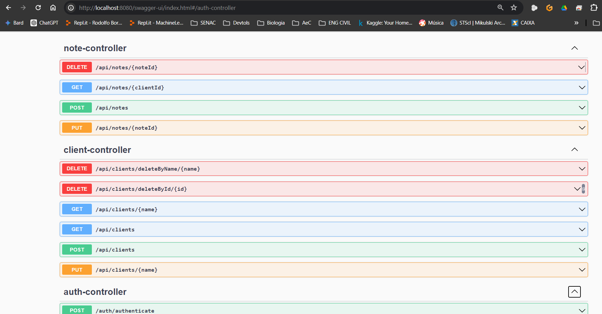
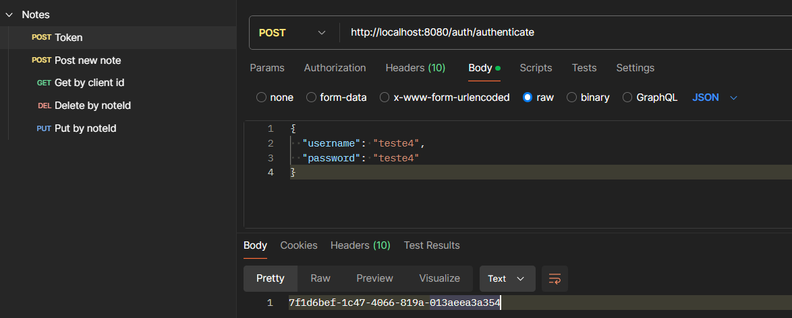
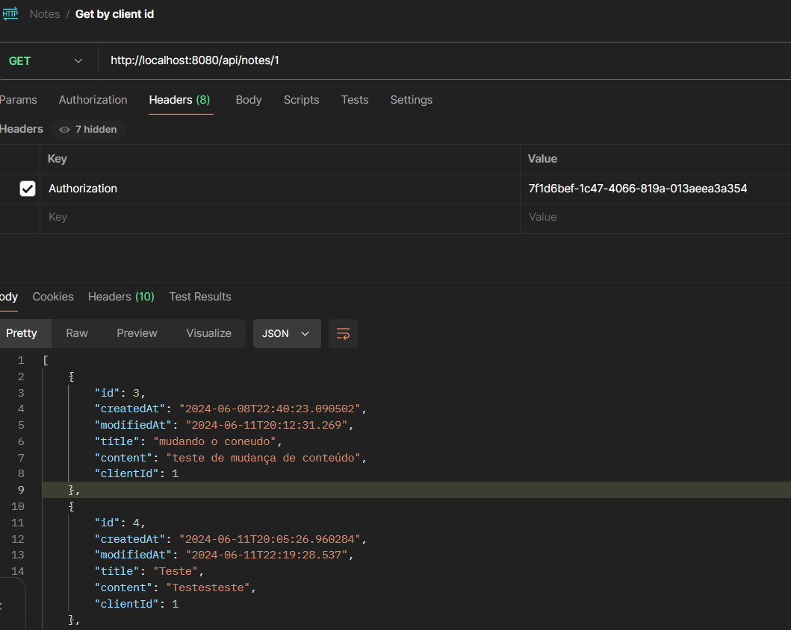
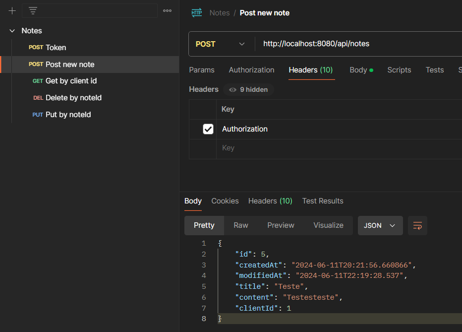
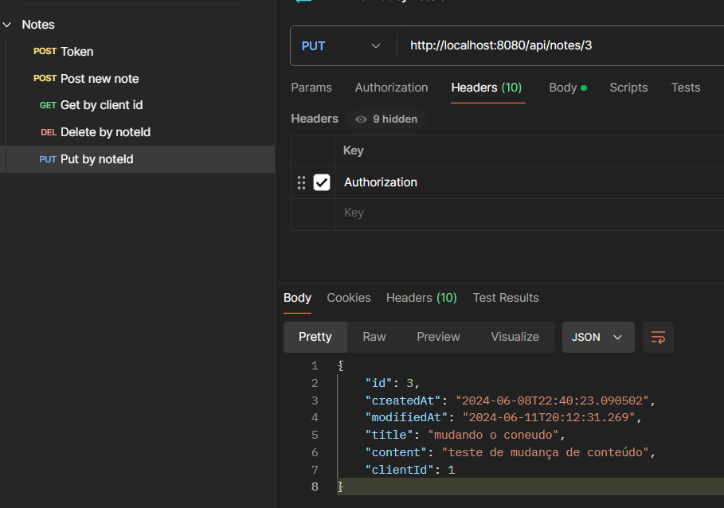
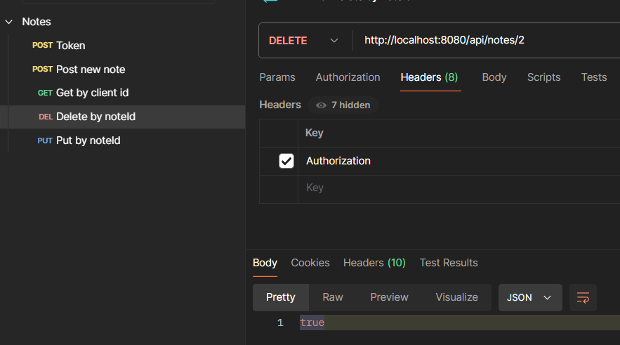
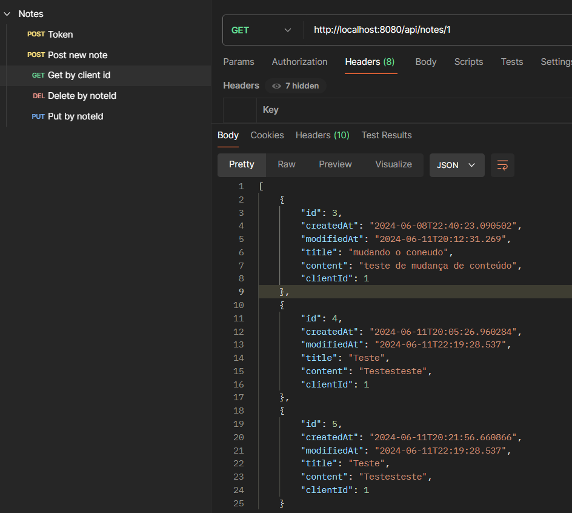
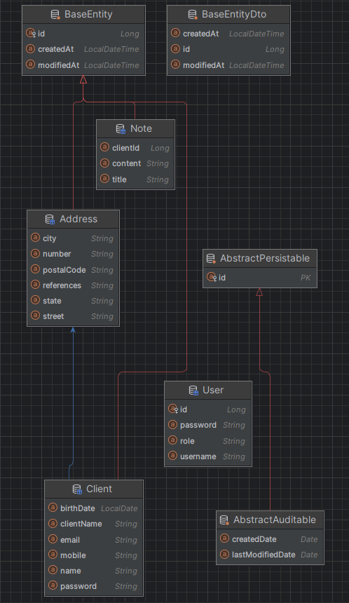
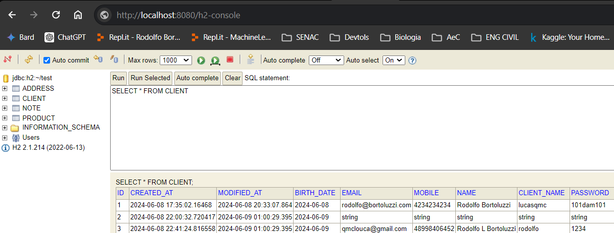

# WebNote - A simple web-based note-taking application

Use http://localhost:8080/swagger-ui.html to access the API documentation

All routes of client-controller are unprotected to allow the user to create an account and login. The routes of 
note-controller are protected and require the user to be authenticated using auth-controller.

The user authentication will generate a simple token that needs to be used in the header Authentication of the requests 
to all routes of note-controller

1 - Token generation

2 - Token usage

3 - Note creation

4 - Note update

5 - Note deletion

6 - Note listing

Data Bank Modeling

Use http://localhost:8080/h2-console to access the database

